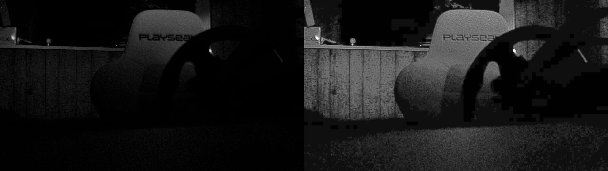

# NightJet

Tiny luma-first low-light enhancement models for images, videos, and
Jetson-class edge deployment.



| | |
| --- | --- |
| **Jetson Orin Nano Super** | **82.9 inferences/sec** — 12.0 ms/frame, FP16 TensorRT @ 1280×720 ([benchmark](#benchmark-jetson-orin-nano-super)) |
| **Model size** | 2,778 parameters — under 20 KB of weights |

NightJet takes a short temporal window of low-light luma frames and predicts an
enhanced luma frame. The public repo includes the default PyTorch weight, a
matching ONNX export, examples, and the training/export tools used to produce
the model.

> Try NightJet live on
> [Hugging Face](https://huggingface.co/spaces/ggamecrazy/nightjet). The
> default model artifacts are at
> [ggamecrazy/nightjet-edge-v1](https://huggingface.co/ggamecrazy/nightjet-edge-v1).
> For managed Jetson/k3s deployment, use
> [KubeJet](https://github.com/cezarc1/kubejet) and its
> [`EdgeVisionPipeline` example](https://github.com/cezarc1/kubejet/blob/main/examples/nightjet-tensorrt.yaml).

## Install

```bash
uv python install 3.12.12
uv sync --locked
```

Run the local checks:

```bash
just check
```

## Enhance An Image

```bash
uv run nightjet enhance \
  --input examples/assets/input.jpg \
  --output outputs/nightjet-image.png
```

The default output is grayscale RGB because the model is trained on luma only.
Use `--preserve-color` to recombine the enhanced luma with the original chroma:

```bash
uv run nightjet enhance \
  --input examples/assets/input.jpg \
  --output outputs/nightjet-color.png \
  --preserve-color
```

Generate a before/after strip:

```bash
uv run nightjet enhance \
  --input examples/assets/input.jpg \
  --output outputs/nightjet-comparison.jpg \
  --side-by-side
```

## Enhance A Video

```bash
uv run nightjet enhance \
  --input path/to/low-light.mp4 \
  --output outputs/nightjet-video.mp4 \
  --preserve-color
```

The video path is causal: each output frame uses only the current frame and
previous frames. At the start of a clip, NightJet pads the window with the first
available frame.

Python examples are in [examples/enhance_image.py](examples/enhance_image.py)
and [examples/enhance_video.py](examples/enhance_video.py).

## Deploy On Jetson

Build a target-specific TensorRT engine on the Jetson/runtime image:

```bash
uv run nightjet build-engine \
  --onnx weights/nightjet-edge-v1.onnx \
  --output outputs/nightjet-edge-v1-fp16.plan \
  --fp16
```

Run the same image/video enhancer through a TensorRT engine:

```bash
uv run nightjet enhance \
  --input examples/assets/input.jpg \
  --output outputs/nightjet-trt.png \
  --engine outputs/nightjet-edge-v1-fp16.plan
```

### Benchmark: Jetson Orin Nano Super

The default `nightjet-edge-v1` engine, built exactly as above from the committed
ONNX, measured on a Jetson Orin Nano Super Developer Kit (JetPack 6 / L4T R36.5,
TensorRT 10.11, FP16, MAXN_SUPER with locked clocks, batch 1, 1280x720 five-frame
luma window, `trtexec` sustained load, 300 iterations):

| Metric | nightjet-edge-v1 @ 720p |
| --- | --- |
| Throughput | **82.9 inferences/sec** |
| GPU compute per frame | 12.0 ms |
| Host→device / device→host transfer | 0.84 ms / 0.25 ms |
| End-to-end engine latency | 13.1 ms |

At 12 ms per frame the model fits comfortably inside a 60 FPS frame budget
(16.7 ms), so on this device the practical ceiling is the camera, not the model.

### Reference Orin Snapshot

Live demo on the same device (July 6, 2026), running a heavier companion model
inside a full camera pipeline: a 1280x720 camera feed enhanced in real time and
served as a 3-way comparison stream (raw / classical / model) over MJPEG,
capped at 15 FPS by configuration.

| Runtime metric | Observed value |
| --- | --- |
| Displayed stream rate | **15.0 FPS** — the configured cap, fully saturated |
| Processing latency (frame read → encoded JPEG) | 89.5 ms |
| Model GPU compute per frame | ~16 ms, run in parallel with CPU work |
| Model cost added to the frame time | 2.1 ms |
| Classical baseline | 22.0 ms |
| 3-way render + JPEG encode | 61.5 ms (on its own thread) |

A live-demo snapshot, not a model benchmark; latencies vary with scene content
and exclude capture-buffer age.

For managed Orin deployments, build the runtime image from
[`docker/Dockerfile.orin`](docker/Dockerfile.orin) and publish it as an
immutable `ghcr.io/cezarc1/nightjet:<tag>-orin` tag. KubeJet examples use the
headless `nightjet serve` command; camera-specific tuning belongs in
hardware-specific runtime manifests or companion repos.

## Public Weights

| Weight | Role | Source run | Notes |
| --- | --- | --- | --- |
| [`weights/nightjet-edge-v1.pt`](weights/nightjet-edge-v1.pt) | Default | `edge-v1-reco-s2-c16-f5-detail-v1-5000` | Conservative 5-frame model with better temporal behavior. |
| [`weights/nightjet-edge-v1-detail.pt`](weights/nightjet-edge-v1-detail.pt) | Detail variant | `edge-v1-reco-s2-c16-f5-reddit10-5000` | Sharper, but more flicker-prone. |

Matching ONNX exports and SHA-256 hashes are recorded in
[`weights/manifest.json`](weights/manifest.json). TensorRT `.plan` and
`.engine` files are not canonical artifacts because they are built for a
specific target device, TensorRT version, precision mode, and runtime image.

See [weights/README.md](weights/README.md) and [MODEL_CARD.md](MODEL_CARD.md)
before redistributing or using the weights beyond research/demo work.

## Docs

| Topic | Link |
| --- | --- |
| Model architecture | [docs/architecture.md](docs/architecture.md) |
| Training and [KubeTorch](https://github.com/cezarc1/kubetorch) runs | [docs/training.md](docs/training.md) |
| ONNX and TensorRT export | [docs/export.md](docs/export.md) |
| Jetson and runtime handoff | [docs/jetson.md](docs/jetson.md) |
| Hugging Face release | [docs/huggingface.md](docs/huggingface.md) |
| Campaign reports | [docs/reports/](docs/reports/) |

`night-vision-orin`, [KubeJet](https://github.com/cezarc1/kubejet), and
[KubeTorch](https://github.com/cezarc1/kubetorch) are advanced companions. They
are useful for camera bring-up, managed Jetson deployment, and GPU training
runs, but they are not required to run `nightjet enhance` on an image or video.

## Train Or Export

Run a CPU smoke train:

```bash
uv run nightjet train \
  --config configs/candidates/edge_v1_reco_s2_c16_f3.yaml \
  --output-dir outputs/smoke \
  --device cpu \
  --max-steps 2
```

Export an ONNX model:

```bash
uv run nightjet export-onnx \
  --checkpoint weights/nightjet-edge-v1.pt \
  --output outputs/nightjet-edge-v1.onnx
```

For full training data preparation and
[KubeTorch](https://github.com/cezarc1/kubetorch) submission commands, see
[docs/training.md](docs/training.md).

## Limitations

- NightJet enhances luma; it is not a full RGB restoration model.
- It cannot recover scene content that the sensor did not capture.
- The detail variant can introduce visible temporal flicker.
- Evaluation so far uses small held-out clips and teacher-derived targets.
- Jetson FPS and latency claims must be measured on the Jetson Orin Nano target,
  not on the GPU training node.

## Artifact Policy

This repo commits source code, documentation, tiny public model weights, matching
ONNX files, and tiny example assets. Datasets, teacher bundles, ad hoc
checkpoints, TensorRT plans/engines, and generated run outputs stay out of git.
